# Web-App-DevOps-Project

Welcome to the Web App DevOps Project repo! This application allows you to efficiently manage and track orders for a potential business. It provides an intuitive user interface for viewing existing orders and adding new ones.

In addition, this repo extends to an end-to-end DevOps pipeline using Continuous Integration and Continuous Deployment using Azure DevOps.

## Table of Contents

- [Features](#features)
- [Getting Started](#getting-started)
- [Technology Stack](#technology-stack)
- [The Process](#the-process)
- [Contributors](#contributors)
- [License](#license)

## Features

- **Order List:** View a comprehensive list of orders including details like date UUID, user ID, card number, store code, product code, product quantity, order date, and shipping date.
  

- **Pagination:** Easily navigate through multiple pages of orders using the built-in pagination feature.
  

- **Add New Order:** Fill out a user-friendly form to add new orders to the system with necessary information.
  

- **Data Validation:** Ensure data accuracy and completeness with required fields, date restrictions, and card number validation.

## Getting Started

### Prerequisites

For the application to succesfully run, you need to install the following packages:

- flask (version 2.2.2)
- pyodbc (version 4.0.39)
- SQLAlchemy (version 2.0.21)
- werkzeug (version 2.2.3)
- azure-identity (version 1.15.0)
- azure-keyvault-secrets (version 4.7.0)

### Usage

To run the application, you simply need to run the `app.py` script in this repository. Once the application starts you should be able to access it locally at `http://127.0.0.1:5000`. Here you will be meet with the following two pages:

1. **Order List Page:** Navigate to the "Order List" page to view all existing orders. Use the pagination controls to navigate between pages.

2. **Add New Order Page:** Click on the "Add New Order" tab to access the order form. Complete all required fields and ensure that your entries meet the specified criteria.

## Technology Stack

- **Backend:** Flask is used to build the backend of the application, handling routing, data processing, and interactions with the database.

- **Frontend:** The user interface is designed using HTML, CSS, and JavaScript to ensure a smooth and intuitive user experience.

- **Database:** The application employs an Azure SQL Database as its database system to store order-related data.

## The Process

### Reused terms

This section contains some terms that are referred to multiple times in the code, usually relating to variables.

- `location`: The location chosen in the code, often to create resource groups, can be chosen to in the same location to avoid delays in data transfer.
- `default`: This is the value that the variable will take if a value is not specified when the variable is called
- `resource_group_name`: This is the name of the resource group. This can be stated in quotation marks or reference variables, or specific qualities of variables, listed in other files in the directory.
- `address_prefix`: This is a reserved ip address or set of ip addresses.

## The Dockerfile

**Containerisation process** 

- Use `FROM` to specify choose an official image and specify the version after the colon. This initiates the build. Here we use `python:3.8-slim`.
- `WORKDIR` specifies the directory in the container which is `/app`.
- `COPY` copies the files from the location on your machine to the location in the container which ensures that the required files are available in the container. In this case, this instruction copies the current directory on your local machine to the working directory in the container (`/app`).
- The two `RUN` steps that follow install the necessary dependencies and the ODBC driver which is needed to obtain order data from the Azure SQL database server.
- The `RUN` step that follows, uses `pip install` to install the dependencies from the `requirements.txt` file.
- `EXPOSE` makes this port available inside the container. In this case, this is port 5000.
- `CMD` is the instruction to run. Here I follow with `python app.py` which will run the flask app specified in the `app.py` file.

**Docker commands**

- To build this image use the command: `docker build -t <image-name>`.
- To use port 5000 locally and run the image use the command: `docker run -p 5000:5000 <image-name>`.
- This makes the app available at `http://127.0.0.1:5000`.
- Tag the image using the command: `docker tag <image-name> <docker-hub-username>/<image-name>:<tag>`
- Here, `<tag>` is the version of the image, which we can replace with tag `latest`.  Specify your Docker Hub username in place of `<docker-hub-username>`.
- I have called my image `custom-image` and the version `latest`.
- To push the image to Docker Hub use the command: `docker push <username>/<image>:<tag>`.
- Check that the image has indeed been pushed to Docker Hub by logging in and clicking on the repository.
- You can pull the image using the command: `docker pull <docker-hub-username>/<image-name>`.
- Run your image locally with the "docker run" command (using port 5000) to check it has the expected result, which in this case is being able to access the app at `http://127.0.0.1:5000`.
- For efficient resource use, any unused containers and images may be removed.
- You can stop containers using `docker stop <container_id>` and then remove it using `docker rm <container_name>`. View this information using `docker ps -a`.
- Use the command `docker images -a` to view all images and remove any using `<docker rmi image_id>`
- Note that if changes are made to app.py, the the command `docker build -t <image-name> .` should be used to rebuild the image.

## Infrastructure as Code (IaC)

**Creating the Service Principal**

The Service Principal is how Terrafrom connects to Azure resources. You need to use the Azure CLI (install it). Once installed, you can login to Azure using the command `az login` from your Command Prompt. This redirects you to an Azure web browser which may be closed after successfully logging in.

In the CLI, use the command below to create the service principal
`az ad sp create-for-rbac --name myApp --role contributor --scopes /subscriptions/{your-subscription-id}/resourceGroups/{your-resource-group-name}`

Replace, `{your-subscription-id}` and `{your-resource-group-name}` with a resource group.

Run these commands:
- `az ad sp list --display-name <name_of_service_principal> --query "[0].appDisplayName"`
- `az ad sp list --display-name <name_of_service_principal>`
- Note down the `id` shown.
- `az ad sp credential reset --id <your_service_principal_id>`
- Copy the outputted information and keep it safe and secure. This will be need to be added to your .bashrc or .zshrc file later on.

**The root directory**

Within the Web-App-DevOps-Project repo we have the `aks-terraform` directory. This contains the necessary IaC. This contains a `main.tf` and `variables.tf` file. In addition it contains two directories: the `aks-cluster-module` directory and `networking-module` directory.

Make sure to add `terraform.tfstate` and `terraform.tfstate.backup` to your .gitignore to avoid accidentally uploading credentials to GitHub. Add `.terraform` to your .gitignore file as well because it is a large file. Push this file to GitHub before the next parts of the directory.

This main.tf file begins with the authentication credentials required for terraform to provision the resources. To use this code, you will need to use your subscription information. You will also need to update your .bashrc file with your `client_id`, `client_secret`, `tenant_id` and `subscription_id`. Variables to access these are in the variables.tf file. It is important not to hardcode these values on GitHub, so these are included as environment variables in the variables.tf file instead, and must be added to your .bashrc or .zshrc file so that they can be accessed by terraform. 

The `main.tf` file also combines the variables listed in the two directories within it, referencing the input variables from the `networking-module` for the `networking module`. It references the input variables from the `aks-cluster-module`, as well as input variables which are outputs of the `networking-module` within the `aks-cluster` block.

### AKS

**The Networking module** 

The `networking-module` contains three terraform files: `main.tf`, `outputs.tf` and `variables.tf`. These three files are typically used in any terraform module. This structured approach makes it easier to use the files.

The networking module uses the following input variables as specified in the `networking/variables.tf` file:
- `resource_group_name`: This is the name of the Azure Resource Group where the networking resources will be deployed.
- `location`: This is the location where the networking resources will be deployed to.
- `vnet_address_space`: This is for the Virtual Network.

The networking module defines the following networking resources:
- Azure Resource Group: This is where the networking resources will be deployed
- Virtual Network (VNet)
- Control Plane Subnet: This hosts the control plane nodes.
- Worker Node Subnet: This hosts the worker nodes.
- Network Security Group (NSG): This controls traffic.

Within the NSG, we have two rules: the `kube-apiserver-rule` and the `ssh-rule`. You must change the public ip address to your own to only allow traffic from your ip address.

The networking module output variables as specified in the associated `output.tf` file:
- `vnet_id`
- `control_plane_subnet_id`
- `worker_node_subnet_id`
- `networking_resource_group_name`
- `aks_nsg_id`

We must run `terraform init` in this directory to initialise the module.

**The Cluster Module**

The `aks-cluster-module` contains three terraform files: `main.tf`, `outputs.tf` and `variables.tf`.

In the `aks-cluster-module/main.tf` file we define the cluster resource. Variables called here are listed in the `aks-cluster-module/variables.tf` file.

Here, also define the node pool (`default_node_pool`). We allow auto-scaling of number of nodes between the values of `1` and `3`.

The service principal credentials are included here as environment variables.

We list the output variables in the `outputs.tf` file:
- `aks_cluster_name`
- `aks_cluster_id`
- `aks_kubeconfig`
These output variables are then referenced in the `aks-terraform/main.tf` file.

We must run `terraform init` in this directory to initialise the cluster module.

**Terraform commands**

Make sure you are in the aks-terraform directory. Run `terraform init`. You should get a message indicating that terraform has been successfully initialised.

I initially encountered an error when running this command. I had to add my service principal as a "Contributor" to my Azure subscription. I did this using Access Control then Role Assignments. Then, I was able to run `terraform init` successfully. 

When you run `terraform plan`, this should indicate the provision 8 resources, which can then be provisioned using the command `terraform apply`. Once created, the `aks-terraform-cluster` should be visible on the Azure portal.

**The YAML file**

In the `application_manifest.yaml` file I define a deployment manifest and a service manifest.

The deployment manifest specifies an external artifact where the Docker image should be retrieved from under `image`. It also specifies the container port to be 5000 which is where the container will be listening. I have included `RollingUpdate` as the deployment strategy. This deployment strategy is chosen so that pods are gradually replaced which means increases the reliability of the app by reducing downtime. The parameters I have included ensure that there is always one pod running. This is because a maximum of one extra pod may be created, and a maximum of one pod may be terminated during this update. (Note that this follows from the replicas specified being 2.)

I use the `---` operator between the deployment and the service so that I can define them both in the same YAML file. 

The service manifest indicates the ports needed locally and for the container, which in this case is port 80 locally, and port 5000 is exposed in the container. This means traffic is directed to port 80. It also specified `ClusterIP`. Using this service means the app is only accessible internally, from your local machine and by anyone with access rights to the cluster.

**Extending Usage**

Should the app need to be made the app available to external users, this could be achieved using an `Ingress` service instead of `ClusterIP` in the `application_manifest.yaml` file. This would make the app accessible externally via the specified port. Ingress uses SSL termination which deals with encrypted traffic and improves security.

### The Continuous Integration and Continuous Deployment (CI/CD) processes

**The DevOps Architecture**

This diagram illustrates how the different components link together for seamless operation, from the build that starts locally to secret management on Azure.

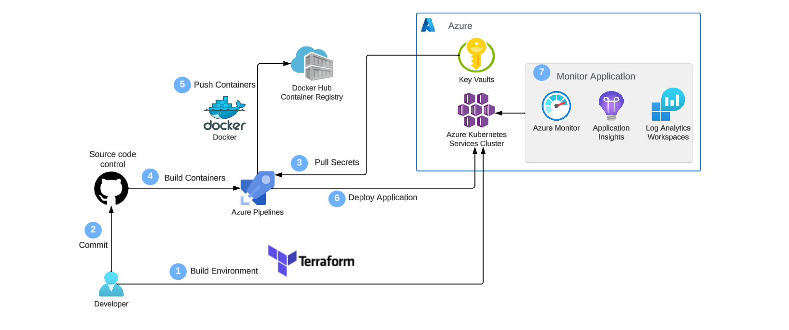

**Automation**

Now we automate the containerisation and deployment process.

Create a new project in Azure DevOps. Under Organisations then Billing, make sure you have billing set up to fund resources. Without this, you will experience issues when attempting to run pipelines later on in the process.

 Under Pipelines, you can create a new pipeline. You can select a source repository. I have picked my GitHub repository and authorised Azure to link to the specific repository Web-App-DevOps-Project. 

**Docker Hub Integration**

It is an important security measure to set up a service connection between Azure DevOps and your Docker Hub account.

In Docker Hub, you can go to Security in your Account Settings and click "New Access Token". This needs to have Read, Write and Delete permissions. Copy this token and keep it safe.

Now, having followed the above steps, go to Project Settings then Security then under Pipelines click "New Service Connection". Choose "Docker Registry".
- Registry type: Docker Hub
- Docker ID: your Docker Hub username
- Password: the personal access token generated previously

**The Build Stage**

I used the Starter Pipeline, and cleared the section after "steps". Then I searched for "Docker Task" and filled in the criteria.
- Select the Docker Hub service connection.
- Specify the Container Repository where the Docker image will be pushed to in the format "Docker_id/container_name".
- Choose the `buildAndPush` command.
- In the "Tags" field, put "latest".
- The Context will already be set as the root directory, so in this case will be `aks-terraform`. 

After filling in these fields click "Add" and "Save" committing this to the main branch, which will add the deployment task to your existing pipeline. Then run the pipeline. Successful execution is indicated by green ticks in the "Jobs" section. Go to Docker Hub to check that the new image is available.

**Azure DevOps and AKS service connection**

On Azure DevOps, navigate to Service Connection which will be in the Pipelines section of Project settings. Click "Create Service Connection". I chose "Secure Principal (manual)" as the Authentication method. Then fill in the criteria. Test then save the connection.

**The Release Stage**

Edit the pipeline on Azure DevOps by adding the "Deploy to Kubernetes" task. To do this, search for the task and fill in the fields.
- Pick "Docker Hub" as your the Container Registry since that is where the image is hosted.
- Pick "Azure Resource Manager" as the Connection Type since we are working with an Azure cluster.
- Choose the Azure Subscription associated with the AKS cluster. This needs to be the service principal associated with the terraform cluster (I initially had an issue with the deployment due to picking the wrong subscription!).
- Enter the name of the Azure resource group where the cluster is located.
- Enter the name of the AKS cluster: `aks-terraform`.
- Enter the name of the manifests: `manifest_deployment.yaml`.

Save and run the pipeline, adding this to the main branch. You can use kubectl pods to check the status of the deployment.

**Verification**

Now any change made locally to the aks-terraform directory that is pushed to the GitHub repository will automatically initiate the Azure DevOps pipeline, and the Docker image will be rebuilt and pushed, and the cluster deployed.

## Azure Key Vault

Using Azure Key Vault means that we do not need to hardcode sensitive information into the code. Azure Key Vaults uses a Managed Identity to retrieve this sensitive information which is stored as secrets in the Key Vault.

**Creating a Key Vault**

From the Azure portal, search for "Key Vaults" and click "Create". Pick the Azure subscription associated with your cluster, relevant resource group, and an appropriate location.The name you choose for your Key Vault here will be used in the "Enabling Managed Identity" section.

**Enabling Managed Identity**

- To enable Managed Identity I used the command: `az aks update --resource-group <resource-group> --name <aks-cluster-name> --enable-managed-identity` replacing `<resource-group>` with the name of my resource group associated with the terraform cluster `networking-resource-group`, and `<aks-cluster-name>` with `aks-terraform-cluster`.
- I used the command `az aks show --resource-group <resource-group> --name <aks-cluster-name> --query identityProfile` to get more information about the Managed Identity. The Managed Identity Client ID shown here should be noted, since it is needed for the role assignment that follows.
- The following command with allow you to assign the role "Key Vault Secrets Officer" to the Managed Identity:
`az role assignment create --role "Key Vault Secrets Officer" --assignee <managed-identity-client-id> --scope /subscriptions/{subscription-id}/resourceGroups/{resource-group}/providers/Microsoft.KeyVault/vaults/{key-vault-name}`
- Here, your Azure subscription ID linked to your cluster and your Key Vault name of the Key Vault containing the cluster secrets are needed.

**Accessing Azure Key Vaults**

In the `app.py` file, there are the following imports to allow retrieval of secrets from Key Vaults. These can be put straight under the other imports in the file.
- `from azure.identity import ManagedIdentityCredential`
- `from azure.keyvault.secrets import SecretClient`

The following code also needs to be put in the file.
- `credential = ManagedIdentityCredential()`
- `secret_client = SecretClient(vault_url=key_vault_url, credential=credential)`

The command `key_vault_uri = ...` must be followed with the Key Vault URI of your Azure Key Vault that contains the secrets for your cluster. This URI can be found if you click on your Azure Key Vault on the Azure portal.

The values are included in this section to demonstrate how to replace and use them in Azure Key Vault.
Each of the four secrets included in the `app.py` file are in the format below. These secrets are needed to connect to the backend Azure SQL database.

In Azure Key Vault, the name of the secret is `database` and its value should be saved as `orders-db` then in `app.py` we have the following lines:
- `secret_database_name = secret_client.get_secret("database")`
- `secret_database_name_value = secret_database_name.value`

In Azure Key Vault, the name of the secret is `server` and its value should be saved as `devops-project-server.database.windows.net` then in `app.py` we have the following lines:
- `secret_server_name = secret_client.get_secret("server")`
- `secret_server_name_value = secret_server_name.value`

In Azure Key Vault, the name of the secret is `password` and its value should be saved as `AiCore1237` then in `app.py` we have the following lines:
- `secret_server_password = secret_client.get_secret("password")`
- `secret_server_password_value = secret_server_password.value`

In Azure Key Vault, the name of the secret is `username` and its value should be saved as `maya` then in `app.py` we have the following lines:
- `secret_server_username = secret_client.get_secret("username")`
- `secret_server_username_value = secret_server_username.value`

Consider `database`. Initially the `database` value was hardcoded. In this case, the first line retrieves the secret database name is called `database`` in the Azure Key Vault. The second line associates this secret with its corresponding value.

These four secrets (database, server, password, username) are used to connect to the backend SQL database that contains the order information.

## Monitoring in Azure ##

From the "Metrics" tab, you can access the metrics used for the graphs below. You are able to change the timescale over which the data is displayed. You may also enable Container Insights via the "Insights" tab. The graphs created can be pinned to your dashboard for ease. The "Metrics" tab can be invaluable for a detailed visual insight to the cluster's performance.

**Average Nodes CPU Usage Percentage per Minute graph**

This graph shows the average CPU usage of nodes in a one minute interval. If this was really high, this would be indicative of an issue with the cluster.

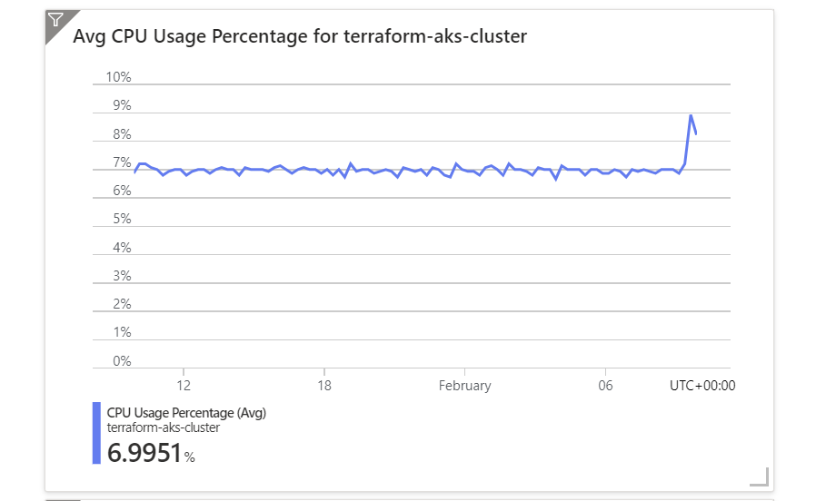

**Average Pod Count in Ready State graph**

This graph shows the average number of pods in Ready State.

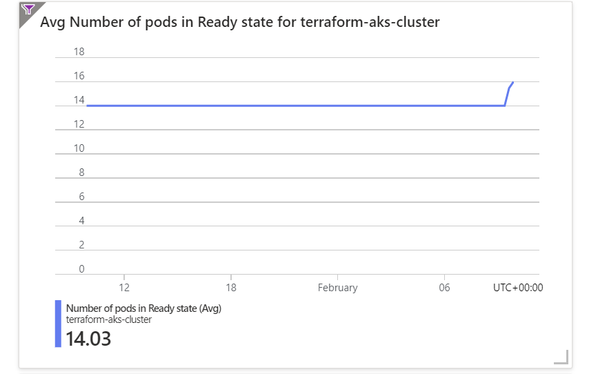

**Used Disk Percentage graph**

This graph shows the Used Disk Percentage of the cluster. We can see that the average value for this is about 8.15% over a 3 day period.

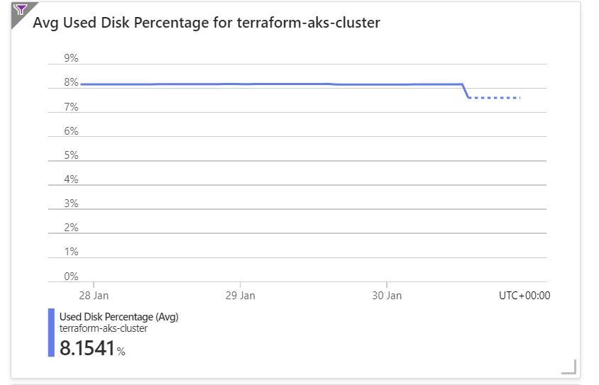

**Bytes Read and Written per Second graph**

A byte is a unit of memory so these graphs show the cluster operation on a granular level. I selected "Bytes read per second" as the first metric. Then added the metric for "Bytes written per second". These are then displayed on the same graph. This particular graph represents a 4 hour period. The graph shows that the bytes written per second is higher than the bytes read per second. 

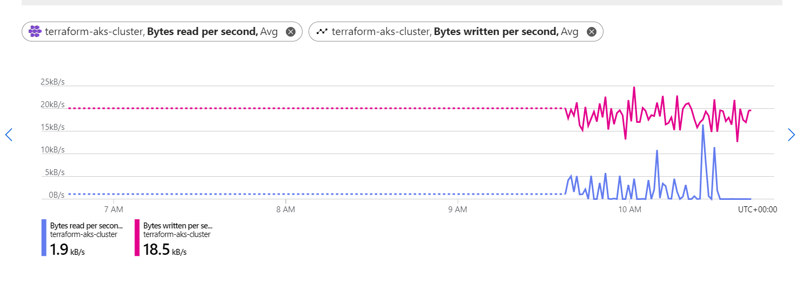

## Log Analytics

Log Analytics can be accessed by clicking on "Logs" in the terraform cluster on Azure. Log Analytics allows you to execute queries about the cluster. These logs exist to help identify any issues in the cluster. When creating the query, the query can be saved under an appropriate name. Some examples with figures for this particular cluster are listed below.

**Average Node CPU Usage Percentage per Minute**

Each row represents one minute in this query. The values are around 7 to 8%. I observed that the numbers here are similar to the numbers on the "Average Node CPU Usage" graph above.

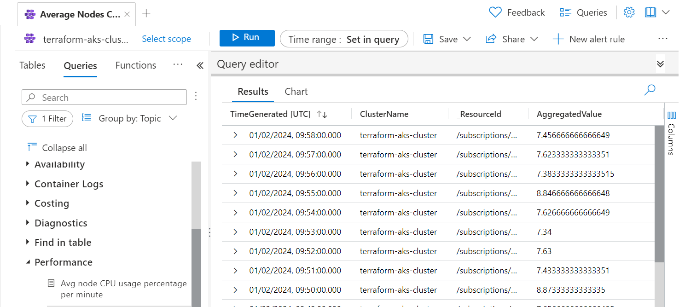

**Average Node Memory Usage Percentage per Minute**

Similar to the query above, each value in this query represents a one minute interval.

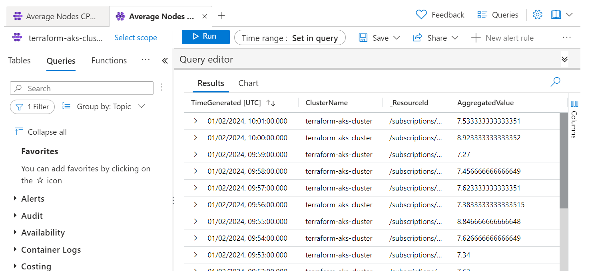

**Pods Counts with Phase**

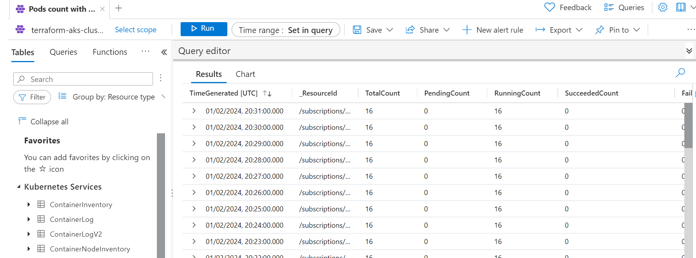

**Find Warning Value in Container Logs**

Here we search for "Find Value in Container Logs." Click "Load to Editor" then type `warning` in as the value. For this particular value, no results where returned.

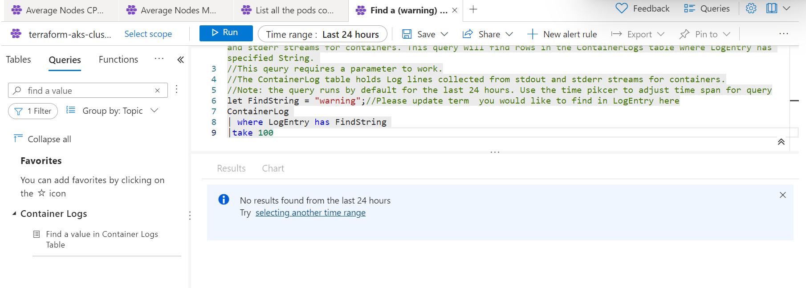

**Monitoring Kubernetes Events**

Here, you can see the events where my cluster had not deployed correctly.

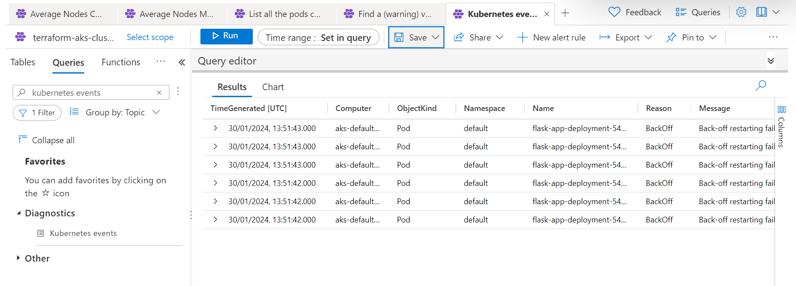

## Alarms

You can set up Alert Rules by clicking on "Alerts" in your terraform cluster in Azure. These can notify you by a chosen method (such as email or SMS) if something is critically wrong with your cluster. 
- You are able to set the threshold values for these rules. If the threshold is exceeded, you are notified.
- These alert rules are assigned to an Alert Action Group, which you will be notified to create.
- You are able to alter the time setting. The "Check Every" is for how often the cluster is checked for the criteria specified in the rule. The "Loopback period" is how far back the cluster is checked. Logically, it makes sense for the the Loopback period to be greater than the "Check Every" value.
- You can edit an alert rule after creation by clicking on it.

Here are some examples of alert rules.

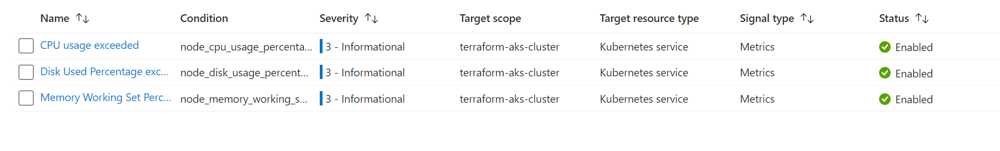

In the above image, the alert rules are as follows.
- CPU usage exceeds 80%: This is recommended by Azure.
- Used Disk Percentage exceeds 90%.
- Memory Working Set Percentage exceeds 80%: This is recommended by Azure.

**Measures to take if an alert rule is triggered**

For some alert rules, you can restart containers or scale the number of containers. Scaling can be done by changing the number of replicas in the configuration file.

We could also set some restrictions within the manifest YAML file in the `containers.spec` section by adding this `resources` block.

`resources:`\
&nbsp;
 &nbsp;`limits:`\
 &nbsp;&nbsp;&nbsp;&nbsp;&nbsp;&nbsp;`memory: <insert_value_here>`\
&nbsp;&nbsp;&nbsp;&nbsp;&nbsp; `cpu:<insert_value_here>`

If the limits specified here are exceeded, Kubernetes will automatically take remediatory actions, such as restarting pods.

## Other branches

The `feature/add-delivery-date` branch was used to apply code changes which would allow the addition of a "delivery date" column. It was then reverted back so this additional column is not present in the `main` branch. The files changed were app.py and orders.html. This branch may be used if you wish to add this column to the orders table.

## Contributors 

- [Maya Iuga]([https://github.com/yourusername](https://github.com/maya-a-iuga))

## License

This project is licensed under the MIT License. For more details, refer to the [LICENSE](LICENSE) file.
